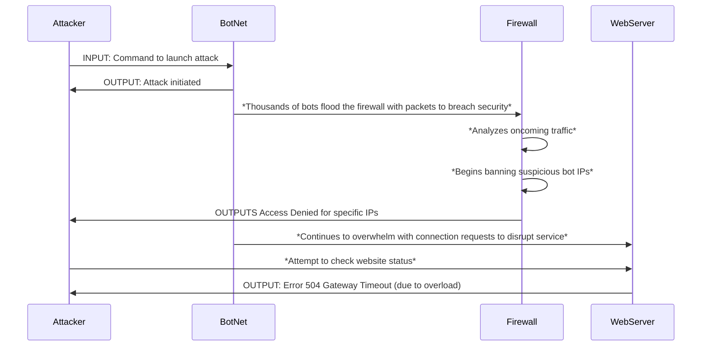

```mermaid
sequenceDiagram
participant Attacker
participant BotNet
participant Firewall
participant WebServer


Attacker ->> BotNet: INPUT: Command to launch attack
BotNet ->> Attacker: OUTPUT: Attack initiated
BotNet ->> Firewall: *Thousands of bots flood the firewall with packets to breach security*
Firewall ->> Firewall: *Analyzes oncoming traffic*
Firewall ->> Firewall: *Begins banning suspicious bot IPs*
Firewall ->> Attacker: OUTPUTS Access Denied for specific IPs
BotNet ->> WebServer: *Continues to overwhelm with connection requests to disrupt service*
Attacker ->> WebServer: *Attempt to check website status*
WebServer ->> Attacker: OUTPUT: Error 504 Gateway Timeout (due to overload)

% Steps:
% The DDoS attack is initiated by "Attacker," who controls thousands of bots in a BotNet that raid and flood the firewall and web server.

% "Firewall" analyzes the oncoming traffic and attempts to ban various IP addresses belonging to the bots, but is eventually overwhelemed. 

% The sheer amount of HTTP requests sent to "WebServer" causes a service disruption, making the site inaccessible due to overload.
```
