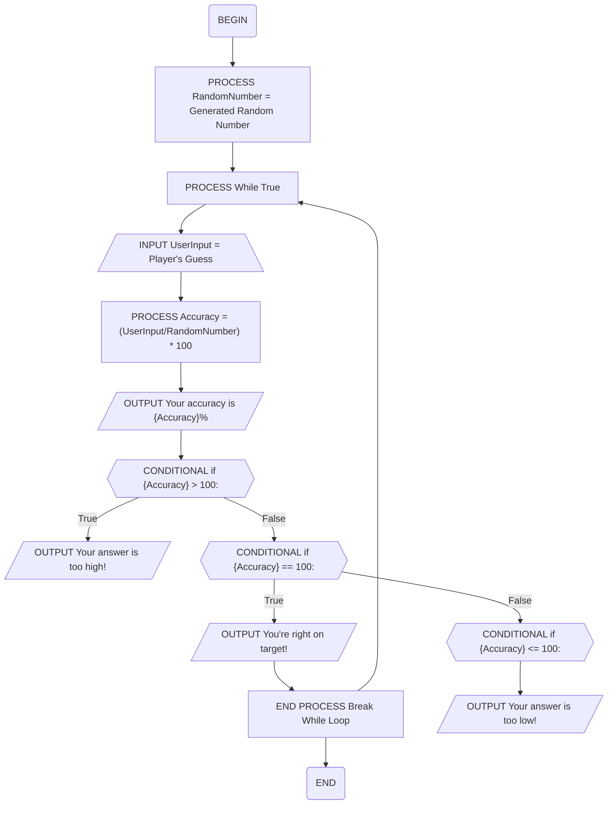

```mermaid
flowchart TD
    A@{ shape: rounded, label: "BEGIN" }
    F@{ shape: rect, label: "PROCESS While True" }
    B@{ shape: rect, label: "PROCESS RandomNumber = Generated Random Number" }
    C[/INPUT UserInput = Player's Guess\]
    D@{ shape: rect, label: "PROCESS Accuracy = (UserInput/RandomNumber) * 100" }
    E@{ shape: lean-r, label: "OUTPUT Your accuracy is {Accuracy}%"}
    G@{ shape: hex, label: "CONDITIONAL if {Accuracy} > 100:" }
    H@{ shape: lean-r, label: "OUTPUT Your answer is too high!"}
    I@{ shape: hex, label: "CONDITIONAL if {Accuracy} == 100:" }
    J@{ shape: lean-r, label: "OUTPUT You're right on target!"}
    K@{ shape: rect, label: "END PROCESS Break While Loop" }
    L@{ shape: hex, label: "CONDITIONAL if {Accuracy} <= 100:" }
    M@{ shape: lean-r, label: "OUTPUT Your answer is too low!"}
    N@{ shape: rounded, label: "END" }

    A-->B
    F-->C
    B-->F
    C-->D
    D-->E
    E-->G
    G--> |True| H
    G --> |False| I
    I --> |True| J
    J --> K
    K --> F
    I --> |False| L
    L --> M
    K --> N
```