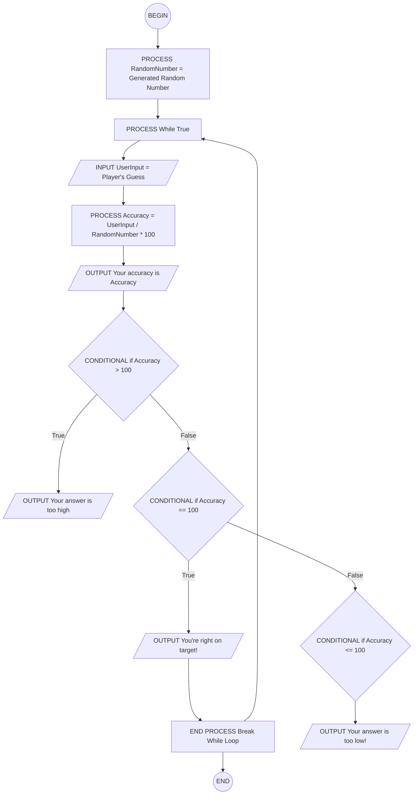

```mermaid
flowchart TD
    A((BEGIN))
    F[PROCESS While True]
    B[PROCESS RandomNumber = Generated Random Number]
    C[/INPUT UserInput = Player's Guess/]
    D[PROCESS Accuracy = UserInput / RandomNumber * 100]
    E[/OUTPUT Your accuracy is Accuracy/]
    G{CONDITIONAL if Accuracy > 100}
    H[/OUTPUT Your answer is too high/]
    I{CONDITIONAL if Accuracy == 100}
    J[/OUTPUT You're right on target!/]
    K[END PROCESS Break While Loop]
    L{CONDITIONAL if Accuracy <= 100}
    M[/OUTPUT Your answer is too low!/]
    N((END))

    A --> B
    F --> C
    B --> F
    C --> D
    D --> E
    E --> G
    G --> |True| H
    G --> |False| I
    I --> |True| J
    J --> K
    K --> F
    I --> |False| L
    L --> M
    K --> N

```