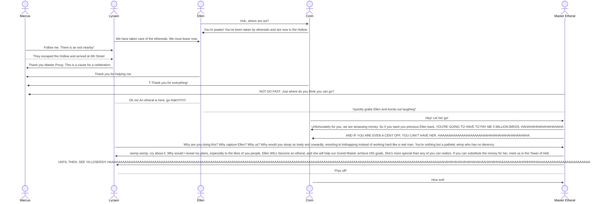

```mermaid


sequenceDiagram
Actor Marcus
Actor Lycaon
Actor Ellen
Actor Corin
Actor Master Etheral

Ellen ->>+ Corin: Huh, where are we?
Corin ->>+ Ellen: You’re awake! You’ve been taken by ethereals and are now in the Hollow
Lycaon ->>+ Ellen: We have taken care of the ethereals. We must leave now.
Marcus ->>+ Lycaon: Follow me. There is an exit nearby!
Marcus -->> Lycaon: They escaped the Hollow and arrived at 6th Street
Lycaon ->>+ Marcus: Thank you Master Proxy. This is a cause for a celebration.
Ellen ->>+ Marcus: Thank you for helping me.
Corin ->>+ Marcus: T-Thank you for everything!
Master Etheral ->>+ Marcus: NOT SO FAST. Just where do you think you can go?
Lycaon -->+ Ellen: Oh no! An etheral is here. go hide!!!!!!!!!!
Master Etheral -->+ Ellen: *quickly grabs Ellen and bursts out laughing*
Corin ->>+ Master Etheral: Hey! Let her go!
Master Etheral ->>+ Corin: Unfortunately for you, we are amassing money. So if you want you precious Ellen back, YOU'RE GOING TO HAVE TO PAY ME 5 MILLION BIROS. HAHAHAHHAHAHAHAHAHA
Master Etheral ->>+ Corin: AND IF YOU ARE EVEN A CENT OFF, YOU CAN'T HAVE HER. HAAAAAAAAAAAAAAAAAAAAAAHAHAHAHAHAHAHAAHAHA.
Lycaon ->>+ Master Etheral: Why are you doing this? Why capture Ellen? Why us? Why would you stoop so lowly and cowardly, resorting to kidnapping instead of working hard like a real man. You're nothing but a pathetic wimp who has no decency. 
Master Etheral ->>+ Lycaon: womp womp. cry about it. Why would I reveal my plans, especially to the likes of you people. Ellen WILL become an etheral, and she will help our Grand Master achieve HIS goals. She's more special than any of you can realize. If you can substitute the money for her, meet us in the Tower of Hell.
Master Etheral ->>+ Lycaon: UNTIL THEN. SEE YA LOSERS!!! HAAAAAAAAAAAAAAAAAAAAAAAAAAAAAAAAAAAAAAAAAAAAAAAAAAAAAAAAAAAAAAAAAAAAAAAAAAAAAAAAAAAAAAAAAAAAAAAAAAAAAAAAAAAAAAAAAAAAAAAAAAAAAAAAAAAAAAAAAAAAAAAAAAAAAAAAAAAAHAHAHAHAHAHAHAHAHAAHAHAHHAAAAAAAAAAHHHHHHHAAAAAAAAAAAAAAAAAAAAAAAAAAAAAAAAAAAAAAAH
Master Etheral -->+ Lycaon: *Flys off*
Corin ->>+ Master Etheral: How evil!
```
