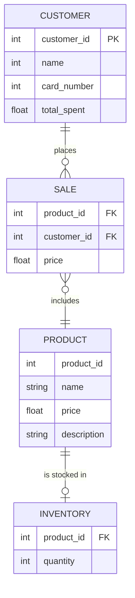

```mermaid
erDiagram
PRODUCT {
    int product_id
    string name
    float price
    string description
}
CUSTOMER {
    int customer_id PK
    int name
    int card_number
    float total_spent
}
SALE {
    int product_id FK
    int customer_id FK
    float price
}
INVENTORY {
    int product_id FK
    int quantity
}
    CUSTOMER ||--o{ SALE : "places"
    SALE }o--|| PRODUCT : "includes"
    PRODUCT ||--o| INVENTORY : "is stocked in"

%% The business is composed of various "products" (an entity). The amount of a certain product can be found in the Inventory entity. A customer (entity) can purchase a product. Anytime a product is sold, a Sale (entity) is initiated, which contains a log of what product was purchased, who purchased it, and for what price.  
```
