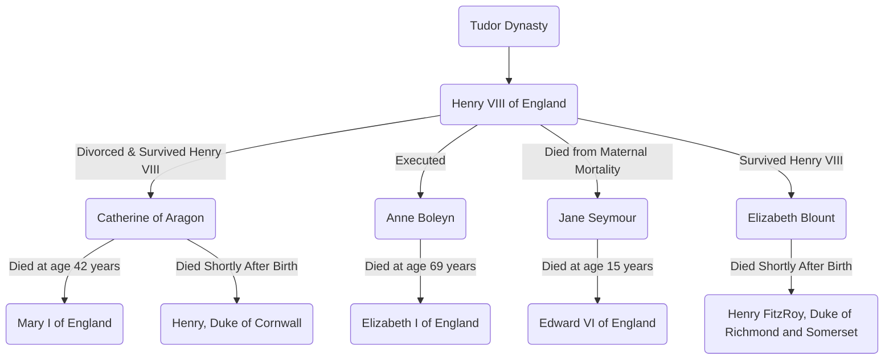
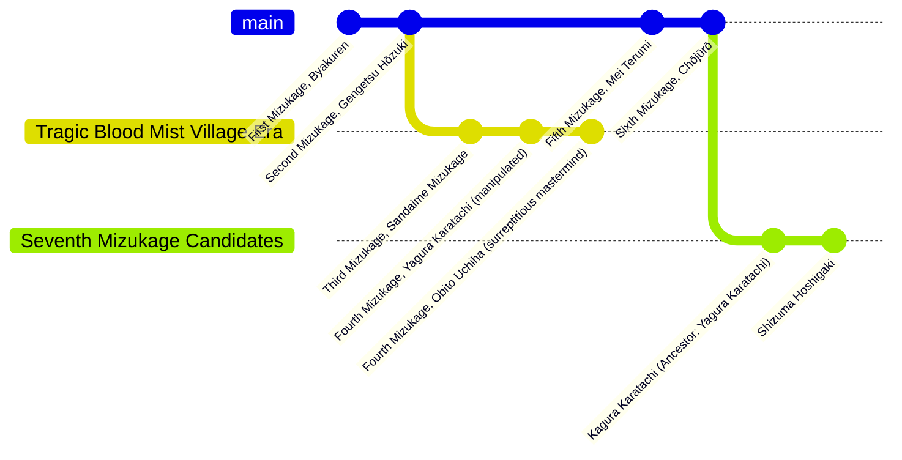

# About Me
## My Interests
I like ***math,*** classical mechanics, and **programming,** particularly in the scripted language Luau. I enjoy working on roleplay games, *particularly* in the ro-nation (U.S, U.K, etc) and anime/closed community genres.

### My Favorite Anime
- Attack on Titan
- Vinland Saga
- Death Note
- Dragon Ball Z
- ~~Boruto: Naruto Next Generations~~
  
### Naruto: The Tailed Beasts
1. Shukaku
2. Matatabi
3. Isobu
4. Son Goku
5. Kokuo
6. Saiken
7. Chomei
8. Gyuki
9. Kurama (Nine-Tailed Fox)
10. Ten Tails (God Tree)

### Naruto: Top 5 Hokage
- [x] Hashirama Senju
- [ ] Tobirama Senju
- [x] Hiruzen Sarutobi
- [x] Minato Namikaze
- [ ] Tsunade Senju
- [x] Kakashi Hatake
- [x] Naruto Uzumaki
- [ ] Shikamaru Nara
- [ ] Madara Uchiha (1st Hokage Candidate)
- [ ] Danzo Shimura (6th Hokage Candidate)

### Favorite Links
[Roblox](www.roblox.com)
- This platform is very cool because there are a ton of games you can play. There are also more serious roleplay groups on the platform.
  
[Discord](www.discord.com)
- This platform is cool because this is where roblox roleplay groups communicate. There are also tons of other non-roblox related communities you can join.
  
[Udemy](www.udemy.com)
- This platform is cool because this is where you can learn new skills. *Sometimes* the courses get incredibly cheap, usually around $9.00+

## My Mermaid Charts
### House of Tudor

### Mizukage of Kirigakure

